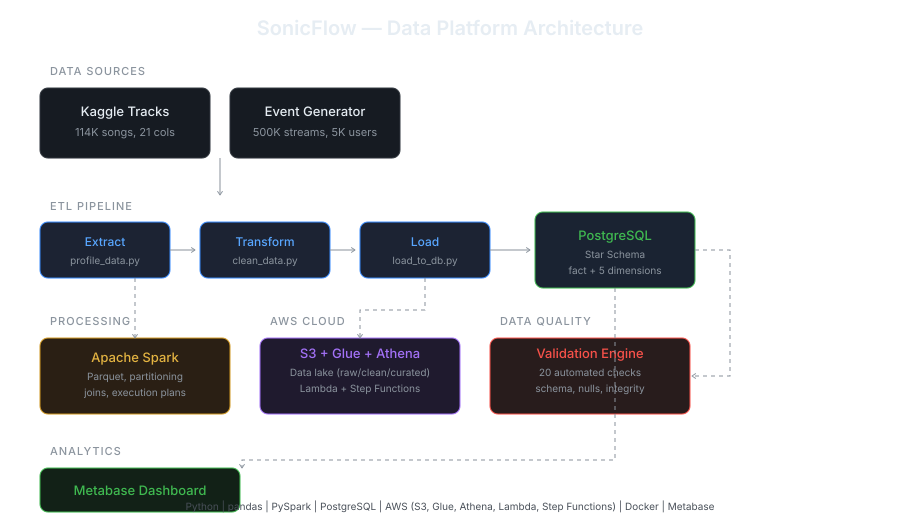

# SonicFlow

An end-to-end data engineering platform for music streaming analytics. Simulates a Spotify-like service with real ETL pipelines, cloud infrastructure, data quality automation, and interactive dashboards.



## What this project does

Raw streaming data (500K events from 5K users across 89K tracks) flows through a multi-stage pipeline: ingested from source, cleaned and deduplicated, loaded into a star schema warehouse, validated automatically, and served through an analytics dashboard. The platform runs locally with Docker and extends to AWS for cloud-native data lake architecture.

## Tech stack

**Data processing:** Python, pandas, Apache Spark (PySpark)

**Storage:** PostgreSQL (star schema), AWS S3 (data lake with raw/cleaned/curated zones), Parquet

**AWS services:** S3, Glue Data Catalog, Glue Crawlers, Athena, Lambda, Step Functions

**Data quality:** Custom 20-check validation framework (schema, volume, nulls, freshness, referential integrity, statistical anomalies)

**Visualization:** Metabase

**Infrastructure:** Docker, Git

## Architecture overview

**Data sources** — Spotify tracks dataset from Kaggle (114K tracks with audio features) combined with synthetically generated streaming events. Events are weighted realistically: popular tracks get more plays, listening peaks in the evening, geographic distribution across 10 countries.

**ETL pipeline** — Python scripts handle extraction, profiling, cleaning (24K duplicate track_ids resolved, multi-artist parsing, null handling), and loading into a PostgreSQL star schema with `fact_streams` at the center connected to `dim_tracks`, `dim_users`, `dim_artists`, `dim_dates`, and `track_genres`.

**Distributed processing** — The pipeline is rebuilt in PySpark to demonstrate distributed data concepts. Includes CSV-to-Parquet conversion (2.3x faster, 2.2x smaller), date-based partitioning (1.8x query speedup via partition pruning), and join optimization (broadcast vs sort-merge strategies analyzed through Spark execution plans).

**Cloud infrastructure** — Three-zone S3 data lake (raw/cleaned/curated) with Glue Data Catalog for metadata management and Glue Crawlers for automated schema discovery. Athena provides serverless SQL queries directly on S3. Lambda functions validate incoming data on upload. Step Functions orchestrate the pipeline with branching logic for success/failure paths.

**Data quality** — Automated validation framework runs 20 checks covering schema validation, row count bounds, null rate monitoring, data freshness, referential integrity (orphan foreign keys), and statistical anomaly detection (listen duration, skip rate, distribution coefficient of variation). Tested with simulated data corruption to verify detection.

**Analytics** — Metabase dashboard connected to PostgreSQL showing top artists, streams by country, listening patterns by hour of day, and skip rates by device.

## Project structure

```
sonicflow/
├── profile_data.py           # Data profiling and exploration
├── clean_data.py             # Cleaning, deduplication, star schema creation
├── generate_events.py        # Realistic streaming event generator
├── load_to_db.py             # PostgreSQL schema and data loading
├── test_queries.py           # Analytical queries on star schema
├── validate_data.py          # 20-check data validation framework
├── simulate_bad_data.py      # Injects data corruption for testing
├── fix_bad_data.py           # Restores clean state
├── spark_learning.ipynb      # PySpark exercises and optimization
├── dataset.csv               # Raw Kaggle dataset
├── dim_tracks.csv            # Cleaned tracks dimension
├── dim_artists.csv           # Cleaned artists dimension
├── dim_users.csv             # Generated users dimension
├── fact_streams.csv          # Generated streaming events
├── track_genres.csv          # Track-to-genre mapping
├── streams_parquet/          # Parquet format output
├── streams_partitioned/      # Year/month partitioned output
└── validation_results.json   # Latest validation report
```

## Quick start

```bash
git clone https://github.com/jeena-krishna/sonicflow.git
cd sonicflow

python3 -m venv venv
source venv/bin/activate
pip install pandas psycopg2-binary

# Start PostgreSQL
docker run --name sonicflow-db \
  -e POSTGRES_USER=jeena -e POSTGRES_PASSWORD=sonicflow123 \
  -e POSTGRES_DB=sonicflow -p 5433:5432 -d postgres:16

# Run ETL pipeline
python3 clean_data.py
python3 generate_events.py
python3 load_to_db.py

# Validate data quality
python3 validate_data.py

# Start dashboard
docker run --name metabase -p 3000:3000 -d metabase/metabase
# Connect at http://localhost:3000 → PostgreSQL → host.docker.internal:5433
```

## Data model

The star schema centers on `fact_streams` (one row per stream event) with dimension tables for context:

| Table | Rows | Description |
|-------|------|-------------|
| fact_streams | 500,000 | Stream events with duration, skip, device, timestamp |
| dim_tracks | 89,740 | Track metadata and audio features |
| dim_users | 5,000 | User profiles with country, plan, age group |
| dim_artists | 29,858 | Unique artists extracted from multi-artist tracks |
| dim_dates | 180 | Date breakdowns for time-based analysis |
| track_genres | 113,549 | Many-to-many track-genre relationships |

## Dataset

Source: [Spotify Tracks Dataset](https://www.kaggle.com/datasets/maharshipandya/-spotify-tracks-dataset) from Kaggle. Streaming events are synthetically generated with realistic distributions.
